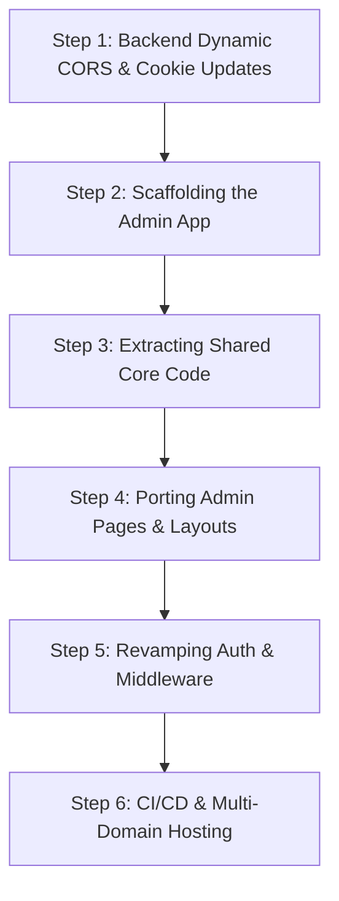

# Architectural Guide: Decoupling the Admin Portal from the Client Frontend

Decoupling the administration panel from the client-facing frontend application is a highly recommended production-grade architecture. Doing so reduces the client-side bundle size, improves security by obscuring administrative endpoints and routes, isolates build/deploy failures, and allows dedicated scaling policies.

This document outlines the **architectural strategies**, **step-by-step separation migration**, **potential complications**, and **practical solutions** tailored uniquely for the ASKI codebase.

---

## 1. Codebase Analysis & Tailored Setup

Your current codebase is structured as a unified monorepo where the frontend Next.js app houses both client routes and admin routes under `frontend/src/app/admin` and `frontend/src/app/user`. 

Fortunately, your Express backend is **already architected to handle multi-origin, multi-domain environments**. Below are the two critical files containing these systems:

### A. CORS Configuration: `backend/app.js`
In [backend/app.js:53-60](file:///home/technonext/Documents/portfolio/aski-mern-nextjs/backend/app.js#L53-L60), the backend compiles allowed CORS origins from both `FRONTEND_HOST` and a comma-separated `FRONTEND_HOSTS` list:
```javascript
const configuredFrontendOrigins = [
  process.env.FRONTEND_HOST,
  ...(process.env.FRONTEND_HOSTS || "").split(","),
  "http://127.0.0.1:3000",
  "http://localhost:3000",
]
```
This is extremely convenient. To enable CORS support for your separated admin frontend, you **do not need to modify any code on the backend**. You only need to add your admin domain to `FRONTEND_HOSTS` in your backend `.env`!

### B. Subdomain Cookie Configuration: `backend/utils/cookieOptions.js`
Your JWT token system uses HttpOnly cookies (`accessToken` and `refreshToken`). In [backend/utils/cookieOptions.js:13](file:///home/technonext/Documents/portfolio/aski-mern-nextjs/backend/utils/cookieOptions.js#L13), the codebase pulls `COOKIE_DOMAIN` directly from environment variables:
```javascript
const domain = process.env.COOKIE_DOMAIN || undefined;
```
If you host your user app at `aski.com` and your admin app at `admin.aski.com`, you can share authentication cookies by simply setting `COOKIE_DOMAIN=".aski.com"` in your backend `.env`.

---

## 2. Decoupling Strategies

Before splitting the code, you must choose an organization pattern for your code repositories:

### Strategy A: Monorepo Workspaces (Highly Recommended)
Keep both frontends inside this single Git repository, but split them into completely independent packages using **npm/pnpm workspaces** and **Turborepo**:

```
aski-mern-nextjs/
├── backend/                   # Express Backend API
├── packages/
│   ├── ui/                    # Shared shadcn components, tailwind configs
│   ├── utils/                 # Shared axiosInstance, date/currency formatters
│   └── types/                 # Shared TypeScript models and definitions
└── apps/
    ├── user-frontend/         # Client Next.js app (aski.com)
    └── admin-frontend/        # Admin Next.js app (admin.aski.com)
```

* **Pros:**
  * **Zero Duplication:** Core UI elements (`Button`, `Card`, `Dialog`) and hooks/utils remain DRY (Don't Repeat Yourself).
  * **Unified Type Safety:** A change in the backend API response types propagates immediately to both apps.
  * **Unified Local Run:** Boot the whole stack with `npm run dev` from the root workspace.
* **Cons:** Requires a short learning curve to configure the workspaces.

### Strategy B: Multirepo Split (Independent Repositories)
Extracting the `frontend/src/app/admin` directory completely into a standalone new git repository.

* **Pros:** Completely isolated git history, deployment pipelines, and access permissions (candidates/contractors don't get access to the admin repository code).
* **Cons:** High maintenance overhead. Shared assets (like your custom Redux slices, Axios configuration, shadcn UI components, types) must either be copied (violating DRY) or packaged and published to a private registry (like GitHub Packages or NPM).

---

## 3. Step-by-Step Separation Plan

Assuming the **Monorepo** or a **Clean Subfolder Split** is chosen, here is the sequence of steps to migrate:



### Step 1: Update Backend Environment
Adjust the production backend `.env` variables to allow cross-site credentials sharing and dynamic origins:
```env
# Allow both standard user port (3000) and new admin port (3001) for development
FRONTEND_HOST="http://localhost:3000"
FRONTEND_HOSTS="http://localhost:3001"

# In production
# FRONTEND_HOST="https://aski.com"
# FRONTEND_HOSTS="https://admin.aski.com"

# Crucial: Prefix with a dot to share cookies with all subdomains
COOKIE_DOMAIN=".aski.com"
COOKIE_SAME_SITE="lax"
```

### Step 2: Scaffold the New Admin Next.js App
Create a separate Next.js boilerplate inside the workspaces folder (or a separate folder) running Next.js:
```bash
npx create-next-app@14 --ts --tailwind --src-dir --app
```

### Step 3: Extract Shared Core Libraries
Copy or link helper libraries to the admin app:
* **Tailwind Configs:** Share the stylesheet, color configuration, and typography.
* **Axios Instance:** Copy `axiosInstance.ts`, adjusting redirect flows.
* **Redux Store:** Set up an isolated Redux store for the admin containing only admin-related state slices.

### Step 4: Migrate Admin Pages & Logic
1. Move the folders inside `src/app/admin` to the root `src/app/` of the new admin project.
2. In the Admin app, the former route `/admin/tutors` will now simply be `/tutors`. 
3. Update all internal page links (`<Link href="/admin/tutors">` becomes `<Link href="/tutors">`).

### Step 5: Implement Admin Middleware & Auth Routing
Write a custom Next.js `middleware.ts` specifically for the Admin application. It only needs to verify if the token contains the `'admin'` role and redirect unauthorized visits directly to the core app's login page or its own landing page.

---

## 4. Complications, Gotchas & How to Handle Them

Splitting code across different hostnames triggers architectural friction. Here are the 5 major complications and how to handle them:

### Complication 1: Authentication & Shared Cookie Storage
* **The Problem:** Your backend sets HttpOnly cookies (`accessToken` and `refreshToken`). If your user site is `aski.com` and admin is `admin.aski.com`, standard cookie mechanisms will block transmission because they are different subdomains.
* **How to Handle it:**
  * Configure the `domain` option when setting cookies on the backend. By prefixing the root domain with a dot (e.g., `Domain=.aski.com`), the browser will share the cookie across the main domain and **all subdomains**.
  * Fortunately, your codebase's `backend/utils/cookieOptions.js` already supports `process.env.COOKIE_DOMAIN` natively!
  * **Production configuration:**
    ```javascript
    // In backend/utils/cookieOptions.js (Line 13)
    const domain = process.env.COOKIE_DOMAIN || undefined; // Will evaluate to '.aski.com'
    ```

### Complication 2: CORS (Cross-Origin Resource Sharing)
* **The Problem:** The Express backend restricts API requests to a single origin configured by `FRONTEND_HOST` (e.g. `http://localhost:3000`). If admin runs on port `3001` or domain `admin.yourdomain.com`, Express will reject its preflight API requests.
* **How to Handle it:**
  * Refactor your Express backend CORS middleware to validate against an array of allowed origins.
  * Fortunately, in your codebase, this is already supported out-of-the-box! Add your admin frontend's URL to `FRONTEND_HOSTS` inside the backend `.env`.

### Complication 3: Shared Code, Types, and shadcn/ui Components
* **The Problem:** Admin forms, layouts, tables, modals, and validation schemas share heavy code intersections with user pages. Copying and pasting them leads to drifting designs and hard-to-maintain synchronization bugs.
* **How to Handle it:**
  * **Path mapping in monorepos:** Set up standard path aliases (e.g., `@/components/*`) in both projects pointing to a shared root directory.
  * **Webpack / Turbopack workspace links:** Set up a clean workspaces config in `package.json`:
    ```json
    "workspaces": [
      "apps/*",
      "packages/*"
    ]
    ```
    This lets you export your UI elements as an NPM dependency `@aski/ui` local package.

### Complication 4: Token Expiration & Authentication Interceptors
* **The Problem:** Look at your `frontend/src/lib/axiosInstance.ts` file:
  ```typescript
  // Line 33-35:
  catch (refreshError) {
    console.error('Token refresh failed, redirecting to login');
    window.location.href = '/account/login?role=user'; // HARDCODED!
    return Promise.reject(refreshError);
  }
  ```
  If this same file is used by the Admin app, an admin whose session expires will be redirected to the **User login page** with the user role instead of the Admin interface.
* **How to Handle it:**
  * Parameterize your `axiosInstance` configuration. Instead of hardcoding URLs, use environment variables to dictate where failed authentication redirects should point:
  * **In Admin App Environment:** `NEXT_PUBLIC_LOGIN_REDIRECT="/login?role=admin"`
  * **In Axios Instance:**
    ```typescript
    const redirectUrl = process.env.NEXT_PUBLIC_LOGIN_REDIRECT || '/account/login?role=user';
    window.location.href = redirectUrl;
    ```

### Complication 5: OAuth (Google / Social Logins)
* **The Problem:** Google OAuth credentials authorize specific redirect URLs (e.g. `http://localhost:3000/api/auth/callback`). If admins authenticate via Google on a separate domain, the authorization flow will trigger redirect errors.
* **How to Handle it:**
  * Create a unified OAuth gate on the backend or register the new domain `/admin` callback within your Google Cloud Console / Credentials section.
  * If the OAuth flow completes on the main domain, write a secure callback page that issues the token cookies and redirects the browser back to `admin.yourdomain.com`.

---

## 5. Summary Matrix: Routing Options

| Approach | Configuration Difficulty | Cookie/CORS Complexity | Infrastructure Requirement | Recommendation |
| :--- | :--- | :--- | :--- | :--- |
| **Subdomain** (`admin.aski.com`) | Medium | High (Shared cookie domains + CORS) | Separate DNS records & SSL | **Best for scaling, team isolation, and security.** |
| **Reverse Proxy** (`aski.com/admin`) | High | Low (Same domain, zero CORS/cookie config) | Nginx/Cloudflare path rewrite rules | **Best if you want to avoid subdomain complexity altogether.** |

---

## Next Steps: Actionable Blueprint

If you decide to proceed with the separation:
1. **Prepare Backend first:** Add `http://localhost:3001` or your admin URL to `FRONTEND_HOSTS` inside the backend `.env`. Set up `COOKIE_DOMAIN` on staging to test subdomain cookie passing.
2. **Setup a Monorepos Structure:** Reorganize folders to prepare a shared core package for UI and utils if possible.
3. **Move pages iteratively:** Start by moving `/admin/settings` first as a prototype before migrating complex lists and charts.
